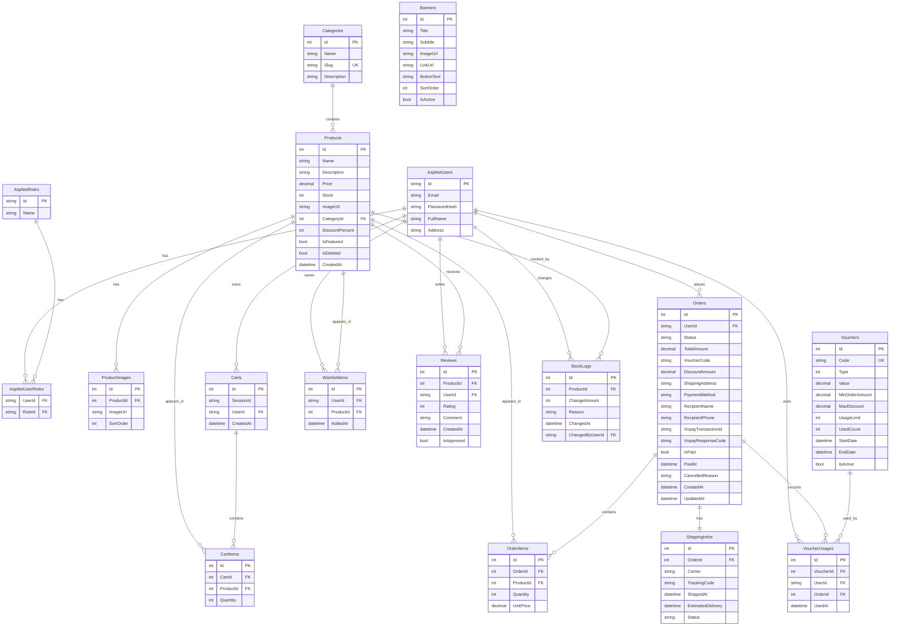

# Nhiệm vụ 1: Kiểm tra CSDL hiện tại

Nguồn kiểm tra: `Data/AppDbContext.cs`, `Models/*.cs`, `Data/Migrations/AppDbContextModelSnapshot.cs`.

## ERD hiện tại

## Điểm bất hợp lý

1. `Orders.Status`, `Orders.PaymentMethod`, `ShippingInfos.Status` đang lưu chuỗi tự do, không có bảng danh mục hoặc ràng buộc CHECK. Dữ liệu dễ bị lệch chính tả/trạng thái ngoài luồng.

2. Trạng thái thanh toán chưa đủ rõ: `Orders` chỉ có `IsPaid`, `PaidAt`, `VnpayResponseCode`, `VnpayTransactionId`. Thiếu bảng/field `PaymentStatus` để phân biệt `Pending`, `Paid`, `Failed`, `Refunded`, `Cancelled`.

3. Voucher bị lưu trùng logic: `Orders.VoucherCode` và `VoucherUsages` cùng ghi nhận mã đã dùng. Dễ lệch dữ liệu nếu một bên cập nhật, một bên không.

4. `VoucherUsages.OrderId` không có unique constraint, nên về mặt CSDL một đơn hàng có thể gắn nhiều dòng voucher usage dù nghiệp vụ hiện tại chỉ áp dụng một mã.

5. `Products.ImageUrl` và bảng `ProductImages` cùng lưu ảnh sản phẩm. Không có quy tắc rõ ảnh nào là ảnh chính, dễ không đồng bộ.

6. `CartItems` thiếu unique constraint `(CartId, ProductId)`. CSDL vẫn cho phép một giỏ có nhiều dòng trùng sản phẩm nếu lỗi xảy ra ngoài service.

7. `OrderItems` chỉ lưu `ProductId`, `Quantity`, `UnitPrice`; thiếu snapshot tên sản phẩm/SKU tại thời điểm mua. Nếu sản phẩm đổi tên hoặc bị xóa vật lý, lịch sử đơn hàng mất ngữ cảnh.

8. Địa chỉ bị lưu dạng chuỗi ở `AspNetUsers.Address` và `Orders.ShippingAddress`, trong khi checkout lại có tỉnh/quận/phường ở UI. CSDL chưa chuẩn hóa địa chỉ, khó thống kê/vận chuyển/lọc theo khu vực.

## Ghi chú kiểm tra nhanh

- Không thiếu bảng chi tiết đơn hàng: đã có `OrderItems`.
- Không lưu mật khẩu plain-text: ASP.NET Identity dùng `AspNetUsers.PasswordHash`.
