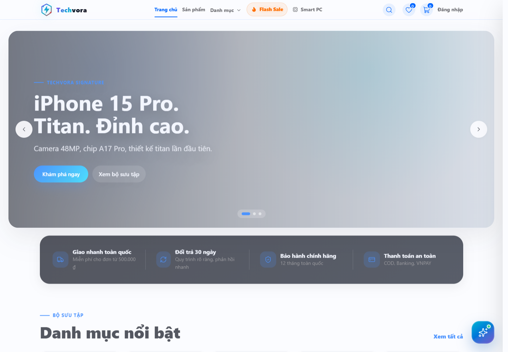
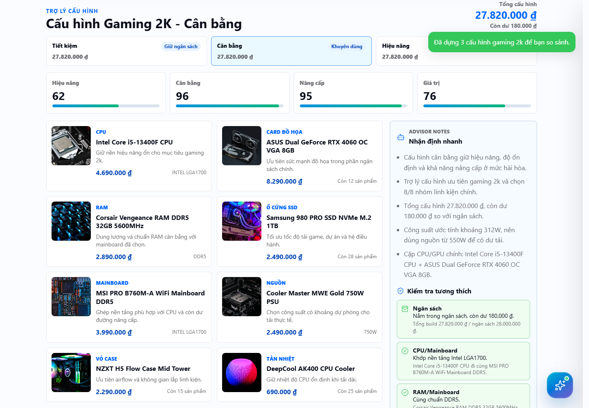
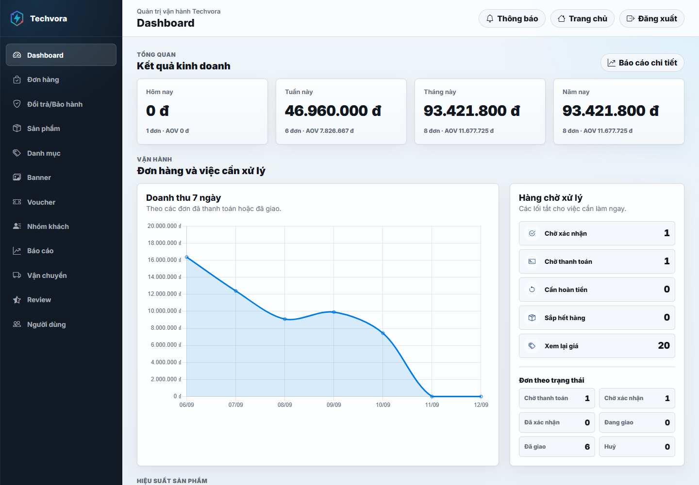

# Techvora — ASP.NET Core E-Commerce

[](https://github.com/Anhtuan2005/E-Lectrical--Commerce-/actions/workflows/ci.yml)

Website bán thiết bị công nghệ bằng **ASP.NET Core 8 MVC, EF Core, SQL Server và ASP.NET Core Identity**. Giao diện tiếng Việt dùng Razor, CSS và JavaScript thuần.

Project tập trung vào quy trình giỏ hàng, voucher, thanh toán, vận chuyển và hậu mãi. **Smart PC Builder** đề xuất cấu hình theo ngân sách và kiểm tra socket, chuẩn RAM, công suất nguồn từ thông số lưu trong database.



## Chức năng nổi bật

| Luồng | Chức năng |
| --- | --- |
| Mua sắm | Tìm kiếm, lọc/sắp xếp, phân trang, gallery, wishlist, so sánh; ghép giỏ khách khi đăng nhập |
| Đặt hàng | Checkout có đăng nhập, voucher theo tài khoản/nhóm khách, COD, VNPAY sandbox, hủy và mua lại |
| Thanh toán | Xác thực callback, đối chiếu số tiền, xử lý callback lặp và thanh toán đến sau khi hủy |
| Vận chuyển/hậu mãi | GHN, theo dõi đơn, yêu cầu đổi trả/bảo hành, thông báo |
| Admin | Sản phẩm, danh mục, banner, voucher, tồn kho, đơn hàng, báo cáo, người dùng; SignalR |
| Smart PC Builder | Ba phương án theo ngân sách; đối chiếu socket/RAM và dự trù nguồn; thêm cấu hình vào giỏ |
| Gợi ý sản phẩm | Chấm điểm hành vi xem, giỏ hàng, wishlist và lịch sử mua; chatbot Gemini tùy cấu hình |





Ảnh chụp từ ứng dụng chạy cục bộ. Đơn hàng, doanh thu và khách hàng trong demo là dữ liệu minh họa. [Kịch bản demo](docs/demo.md).

## Chạy với .NET và SQL Server

Yêu cầu: .NET SDK 8 trở lên, SQL Server có quyền tạo database. Node.js 22 dùng để sửa/build CSS và JavaScript; các asset đã build có sẵn trong repo.

```powershell
git clone https://github.com/Anhtuan2005/E-Lectrical--Commerce-.git
cd E-Lectrical--Commerce-
dotnet restore EcommerceApp.sln
dotnet tool restore

# Thay server nếu dùng SQL Server named instance.
dotnet user-secrets set "ConnectionStrings:DefaultConnection" "Server=localhost;Database=TechvoraDemo;Trusted_Connection=True;TrustServerCertificate=True;Encrypt=False"
dotnet tool run dotnet-ef database update

# Chỉ bật seed trên database demo riêng.
$env:Demo__Enabled = "true"
$env:Email__Enabled = "false"
dotnet run --project EcommerceApp.csproj --launch-profile http
```

Mở [http://localhost:5009](http://localhost:5009). Muốn dùng HTTPS: chạy `dotnet dev-certs https --trust`, sau đó dùng profile `https`.

| Tài khoản demo | Mật khẩu | Quyền |
| --- | --- | --- |
| `admin@shop.vn` | `Admin@123` | Admin |
| `khachhang1@shop.vn` | `User@123` | Khách hàng |

`Demo:Enabled` mặc định `false` và bị từ chối trong `Production`. Seed tạo catalog, thông số linh kiện, voucher và đơn minh họa; không gọi nhà cung cấp ngoài. Khi dùng xong, xóa biến demo bằng `Remove-Item Env:Demo__Enabled`.

## Demo bằng Docker

```powershell
$env:DEMO_SQL_PASSWORD = "Choose_A_Local_Demo_Password123!"
docker compose -f compose.demo.yml up --build
```

Mở [http://localhost:8080](http://localhost:8080). Compose gồm SQL Server và web, tự migrate/seed `TechvoraDemo`, chỉ bind web vào localhost. Dữ liệu được giữ trong Docker volumes. File này dành cho demo cục bộ.

## Kiểm thử

Integration test dùng **SQL Server thật**, tạo database `TechvoraTests_<guid>` mới mỗi lần chạy và xóa đúng database đó khi hoàn tất. Database trong connection string đầu vào không bị dùng làm database test.

```powershell
$env:TECHVORA_TEST_SQLSERVER = "Server=localhost;Trusted_Connection=True;TrustServerCertificate=True;Encrypt=False"
dotnet test EcommerceApp.sln --configuration Release
```

Không đặt biến trên thì test dùng SQL Server mặc định trên localhost với Windows Authentication. Với SQL Server container, truyền `User Id`, `Password` và port phù hợp.

Các trường hợp được kiểm tra:

- Checkout commit đơn hàng, tồn kho và giỏ hàng cùng nhau khi bật retry.
- Hai khách mua món cuối cùng hoặc tranh lượt voucher cuối.
- Hủy đơn đồng thời chỉ hoàn tồn kho một lần.
- Callback VNPAY lặp, callback sau khi hủy, cập nhật trạng thái admin.
- Đơn VNPAY hết hạn: worker, khách huỷ và callback đến muộn tranh cùng một đơn; hoàn kho một lần, thanh toán muộn vào hàng chờ hoàn tiền.
- Chặn chuyển trạng thái ngược, xác nhận hàng loạt tranh với huỷ đơn; webhook GHN lặp/đến sai thứ tự.
- Form sản phẩm cũ không ghi đè tồn kho; điều chỉnh kho đồng thời với checkout, rollback nếu không ghi được lịch sử.
- Lọc theo giá sau giảm và làm tròn; dashboard/báo cáo loại đơn huỷ, chờ hoàn và đã hoàn tiền.
- Chặn tràn số lượng giỏ và checkout số lượng không dương; database cũng từ chối số lượng sai.
- Cả hai đường xoá danh mục giữ nguyên sản phẩm/lịch sử đơn, kể cả sản phẩm đã ẩn; khoá ngoại ngăn xoá dây chuyền.
- Khoá/mở khoá/đổi quyền thu hồi cookie cũ; chặn tự khoá/tự gỡ Admin và hai admin thu hồi quyền của nhau đồng thời.
- Đơn huỷ/hoàn tiền không tạo quyền lợi VIP; yêu cầu đổi trả đồng thời không vượt số lượng đã mua và không mở lại yêu cầu đã đóng.
- Retry sau lỗi tạm thời không giữ entity từ transaction đã rollback.
- Reset mật khẩu không hợp lệ giữ mật khẩu cũ; token hết hạn/dùng lại/dùng đồng thời; vô hiệu hóa các link còn lại sau khi reset.
- Production không seed admin/demo; chặn bật demo nhầm môi trường.
- Build PC kiểm tra metadata socket/RAM/nguồn và loại sản phẩm hết hàng.

Smoke test trình duyệt trên bản demo đang chạy:

```powershell
npm ci
$env:TECHVORA_SMOKE_URL = "http://localhost:5009"
npm run test:smoke
```

Mặc định dùng Microsoft Edge đã cài. Máy không có Edge:

```powershell
npx playwright install chromium
$env:PLAYWRIGHT_CHANNEL = "chromium"
npm run test:smoke
```

GitHub Actions kiểm tra asset, build Release, integration test, migration, publish và smoke test desktop/mobile trên database demo riêng.

## Cấu trúc

```text
Controllers/                 HTTP, phân quyền, trả View/JSON
Services/                    Nghiệp vụ và tích hợp ngoài
  SmartPcBuildService.cs     Tải inventory từ database
  SmartPcBuildEngine*.cs     Chọn cấu hình và kiểm tra thuần C#
Data/                        EF Core, migration, seed, transaction retry
Models/                      Entity và ViewModel
Views/                       Razor storefront/admin
ClientAssets/                CSS/JS theo chức năng; manifest giữ thứ tự ghép
wwwroot/                     Asset trình duyệt và bản minify
tests/EcommerceApp.Tests/    Unit test và SQL Server integration test
tests/browser/               Playwright smoke test
docs/                        Kiến trúc, ERD, demo, ghi chú CV
```

[Kiến trúc và ERD](docs/architecture.md) · [ADR transaction/reset mật khẩu](docs/adr/0001-transaction-and-password-reset.md) · [Ghi chú CV](docs/portfolio.md)

Sửa storefront trong `ClientAssets/css` và `ClientAssets/js`, rồi chạy:

```powershell
npm ci
npm run build:assets
npm run check:assets
```

Manifest giữ nguyên thứ tự cascade. Script sinh `site.css`, `site.js` và các file `.min.*` bằng esbuild; CI phát hiện source và output không đồng bộ. Source `admin.js`, `admin.css`, `buildpc.js` vẫn nằm trong `wwwroot` và cũng được minify bằng script này.

## Cấu hình và triển khai

Dùng user secrets khi phát triển, biến môi trường khi triển khai; trong biến môi trường, thay `:` bằng `__`.

| Cấu hình | Mục đích |
| --- | --- |
| `ConnectionStrings:DefaultConnection` | SQL Server của môi trường đích |
| `Database:MigrateOnStartup` | Mặc định `false`; production nên migrate riêng trước khi chạy web |
| `Demo:Enabled` | Seed demo; mặc định `false` |
| `BootstrapAdmin:Email`, `BootstrapAdmin:Password` | Tạo admin mới bằng secrets; không ghi đè mật khẩu/nâng quyền tài khoản khách đã tồn tại |
| `Vnpay:TmnCode`, `HashSecret`, `BaseUrl`, `ReturnUrl`, `IpnUrl` | VNPAY sandbox; callback URL phải khớp merchant |
| `Email:Enabled`, `Host`, `Port`, `UserName`, `Password`, `FromEmail`, `FrontendUrl` | SMTP và URL trong email reset |
| `Ghn:Token`, `ShopId`, `WebhookSecret` | GHN; webhook kiểm tra secret và ShopID |
| `Gemini:ApiKey`, `Model` | Chatbot; tên model tùy tài khoản/provider |
| `Seo:BaseUrl` | URL công khai dùng cho canonical/sitemap |
| `DataProtection:KeysPath` | Thư mục key cần lưu bền vững |

VNPAY return: `/payment/vnpay-return`; IPN: `/payment/vnpay-ipn`. GHN webhook: `/shipping/ghn-webhook?secret=<configured-secret>`.

Production: migrate trước, đặt secrets admin/dịch vụ, giữ `Demo:Enabled=false`, cấu hình HTTPS/reverse proxy, lưu bền vững key và ảnh upload. Sau khi tạo admin, gỡ secrets bootstrap. Nếu database từng dùng demo, đổi mật khẩu hoặc vô hiệu hóa tài khoản demo trước khi triển khai. Health endpoints: `/health/live`, `/health/ready`.

## Đơn hàng, tồn kho và doanh thu

- VNPAY giữ hàng **15 phút từ lúc đặt đơn**. Thanh toán lại giữ nguyên hạn; worker quét mỗi 30 giây (tối đa 100 đơn/lượt), tự huỷ và hoàn kho khi quá hạn. Callback tự kiểm tra hạn ngay cả khi worker chưa chạy. Tiền đến sau hạn được ghi nhận để hoàn thủ công, không mở lại đơn.
- Admin xác nhận đơn trước khi giao; đơn đã giao/huỷ không quay lại xử lý. VNPAY chưa trả tiền không được xác nhận hay gán vận chuyển. Vận đơn hoàn hàng/đã huỷ cần kiểm tra thực tế; webhook không tự hoàn kho khi hàng còn ở bên vận chuyển.
- Sửa thông tin sản phẩm dùng `rowversion`; form cũ báo xung đột và yêu cầu tải lại. Nhập/xuất kho dùng số lượng tăng/giảm cùng lý do; cập nhật và lịch sử nằm trong một transaction.
- Dashboard/báo cáo chỉ tính đơn đã thanh toán hoặc COD đã giao, loại đơn huỷ và mọi đơn có trạng thái hoàn tiền. Kỳ báo cáo theo ngày tạo đơn UTC. Tổng đơn gồm phí giao và trừ voucher; thống kê sản phẩm/danh mục là tiền hàng trước voucher và phí giao, nên không nhất thiết bằng tổng doanh thu.
- Migration `HardenOrderLifecycleAndProductConcurrency` thêm phiên bản sản phẩm và hạn thanh toán. Đơn VNPAY cũ được đặt hạn bằng ngày tạo + 15 phút; worker sẽ xử lý đơn chưa trả tiền đã quá hạn khi ứng dụng khởi động.
- Giỏ dùng phép cộng số lượng qua `long` để kiểm tra giới hạn tồn kho, checkout kiểm tra lại số lượng dương. Sản phẩm hết hàng được bỏ khỏi giỏ khi cập nhật số lượng thay vì lưu dòng có số lượng 0.
- Xoá danh mục chỉ được phép khi không còn sản phẩm, bao gồm sản phẩm đã ẩn. Migration `ProtectQuantitiesAndOrderHistory` chuyển khoá ngoại danh mục/sản phẩm và sản phẩm/chi tiết đơn sang `Restrict`, thêm ràng buộc số lượng dương. Migration xoá dòng giỏ có số lượng không dương; nếu lịch sử đơn/hỗ trợ có số lượng sai thì dừng để đối soát, không tự sửa lịch sử.
- Phân nhóm VIP dùng cùng quy tắc doanh thu với dashboard, loại đơn huỷ và mọi đơn có trạng thái hoàn tiền.

## Quyền tài khoản và đổi trả

- Khoá, mở khoá hoặc đổi vai trò làm mới security stamp; cookie cũ bị từ chối ở request xác thực tiếp theo. Mỗi request có đăng nhập kiểm tra tài khoản trong database, bao gồm trạng thái khoá. Người dùng phải đăng nhập lại sau khi mở khoá/cấp quyền.
- Admin không tự khoá hoặc tự gỡ quyền. Các thay đổi quyền được tuần tự hoá bằng khoá role Admin trong transaction và kiểm tra lại người thực hiện, để hai admin không thể thu hồi quyền của nhau đồng thời hoặc làm mất admin hoạt động cuối cùng.
- Tổng số lượng yêu cầu hỗ trợ đang xử lý và đổi trả đã hoàn tất không được vượt số đã mua. Yêu cầu bị từ chối giải phóng số lượng; bảo hành hoàn tất cho phép gửi yêu cầu mới sau này. Đổi trả hoàn tất được tính là đã dùng số lượng đổi trả đó.
- Luồng hỗ trợ: mới gửi → đang xử lý → đã duyệt → hoàn tất; có nhánh chờ khách bổ sung hoặc từ chối. Hoàn tất/từ chối là trạng thái kết thúc, giữ nguyên ghi chú và thời điểm hoàn tất. Đây là quản lý yêu cầu; hoàn tiền, nhập hàng trả và gửi hàng thay thế vẫn cần xử lý nghiệp vụ riêng.

Chi tiết quy tắc: [kiến trúc](docs/architecture.md).

## Giới hạn hiện tại

- Build PC dùng quy tắc và heuristic; điểm hiệu năng không phải benchmark. Socket/RAM chưa thay thế kiểm tra BIOS, kích thước, đầu cấp điện hay danh sách CPU mainboard hỗ trợ.
- VNPAY/GHN/SMTP/Gemini cần credentials riêng; test giả lập adapter ngoài, không xác nhận giao dịch thật.
- Hoàn tiền đang theo dõi/xác nhận thủ công; hóa đơn tạo cục bộ.
- Worker hết hạn chạy trong ứng dụng; khi ứng dụng tắt, hàng được giải phóng ở lần khởi động tiếp theo. Thanh toán đến sau hạn vẫn xử lý theo luồng hoàn tiền thủ công.
- Tạo vận đơn GHN và lưu database chưa có cơ chế đối soát tự động; nếu trạng thái đổi trong lúc gọi GHN, admin nhận mã vận đơn để kiểm tra/huỷ ở nhà vận chuyển.
- Email/thông báo sau commit chưa có transactional outbox. Khi lỗi tại commit khiến kết quả không rõ, cần đối soát đơn trước khi thao tác lại.
- Sản phẩm cũ chưa có metadata linh kiện cần cập nhật trong admin. Thông số trình bày khác và ảnh mẫu cần rà soát trước khi dùng cho cửa hàng thật.
- Chưa có số liệu kiểm thử tải lớn hoặc SLA để công bố.
