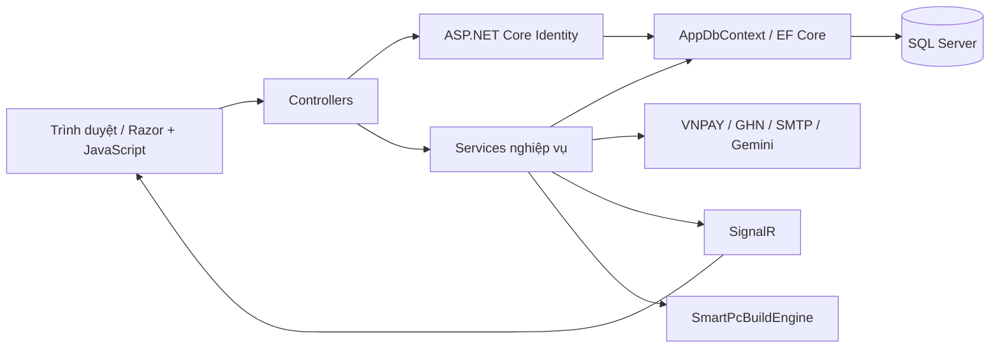
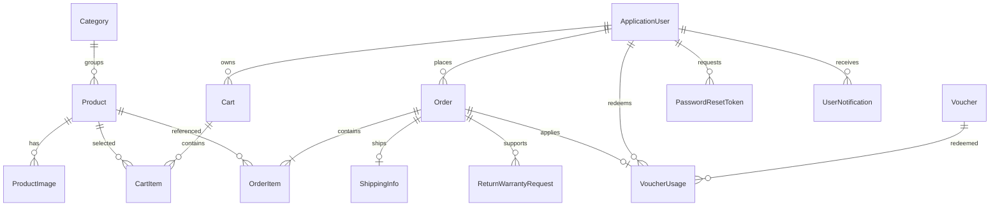

# Kiến trúc Techvora

ASP.NET Core MVC monolith: controller xử lý HTTP/phân quyền, service xử lý nghiệp vụ, EF Core truy cập SQL Server. Cách tổ chức này giữ việc chạy local đơn giản và kiểm tra transaction trên đúng database provider.

## ERD rút gọn

`Product.Socket`, `MemoryType`, `PowerWatts` nullable: null là chưa biết/không áp dụng. Giá khi đặt hàng được chụp vào `OrderItem.UnitPrice`, không tính lại theo giá sau này.

## Transaction và cạnh tranh

`DatabaseTransaction.ExecuteAsync` chạy toàn bộ unit of work qua execution strategy: tải lại entity, mở transaction, ghi và commit. Trạng thái tracking cũ được bỏ trước mỗi lần thử. Caller không được để thay đổi chưa lưu đi vào helper này.

- Checkout tính giá/voucher ở server; trừ kho bằng `UPDATE ... WHERE Stock >= quantity`. Giỏ, lượt voucher và đơn cùng transaction.
- Hủy đơn/callback khóa order bằng `UPDLOCK`; đọc lại trạng thái trước khi thay đổi.
- Xác nhận hàng loạt và cập nhật vận chuyển dùng cùng khóa order và `OrderLifecycle`. Mỗi đơn trong thao tác hàng loạt có transaction riêng; chỉ đơn còn chờ xác nhận mới được tính thành công.
- Product có SQL `rowversion`. Sửa metadata/ảnh kiểm tra phiên bản gốc và không gán tồn kho tuyệt đối. Điều chỉnh kho dùng phép cộng có điều kiện (`0 <= Stock + delta <= int.MaxValue`) và ghi StockLog trong cùng transaction.
- Callback kiểm tra chữ ký, số tiền, phương thức. Đơn đã trả tiền không phát lại email trạng thái.
- Reset mật khẩu khóa user, kiểm tra lại token, dùng Identity để đổi mật khẩu và vô hiệu hóa các token còn lại trong cùng transaction.
- Email và SignalR ở ngoài phần retry.

Integration test tạo database mới, chạy migration và dùng nhiều scope/connection để kiểm tra cạnh tranh. Đối soát commit không rõ kết quả và transactional outbox là các bước phát triển tiếp.

## Vòng đời đơn và hết hạn thanh toán

| Trạng thái | Chuyển tiếp hợp lệ bởi admin |
| --- | --- |
| Chờ thanh toán | Chờ xác nhận sau khi đã trả tiền; huỷ |
| Chờ xác nhận | Đã xác nhận; huỷ |
| Đã xác nhận | Đang giao; huỷ |
| Đang giao | Đã giao (vận đơn không bị huỷ/hoàn hàng) |
| Đã giao / Huỷ | Giữ nguyên trạng thái |

Khách chỉ huỷ đơn chờ thanh toán/chờ xác nhận. Gán vận chuyển chỉ nhận đơn đã xác nhận/đang giao, VNPAY phải đã trả tiền. GHN có thể báo đã giao trực tiếp từ đơn đã xác nhận khi bỏ lỡ các webhook trung gian; không được hồi sinh đơn huỷ hoặc làm lùi đơn đã giao. Sự kiện lấy hàng đến sau đang vận chuyển bị bỏ qua. Huỷ vận đơn/hoàn hàng không có nghĩa hàng đã nhập lại kho; giữ trạng thái để nhân viên xử lý thực tế.

`PaymentExpiresAt` lưu UTC, cố định 15 phút từ checkout. URL VNPAY dùng cùng hạn theo UTC+7. Worker chạy ngay khi khởi động và mỗi 30 giây, lấy tối đa 100 đơn quá hạn rồi khóa/kiểm tra lại từng đơn. Thanh toán, huỷ và hết hạn cùng tranh một khóa; chỉ lần chuyển sang huỷ đầu tiên mới hoàn kho. Callback đến sau hạn tự huỷ trước khi ghi nhận `IsPaid` và `PendingManual`, kể cả khi worker chưa quét. Không đổi `IsPaid` thành false sau hoàn tiền vì đây là lịch sử nhận thanh toán.

`RevenueQueries` định nghĩa chung cho dashboard, báo cáo và xếp hạng bán chạy: đơn chưa huỷ, không chờ/đã hoàn tiền, và đã trả tiền hoặc đã giao COD. Kỳ thống kê dùng `CreatedAt` UTC; đây là báo cáo bán hàng theo đơn, chưa phải sổ kế toán tiền vào/ra theo ngày đối soát. Thống kê sản phẩm dùng `UnitPrice × Quantity`, chưa phân bổ voucher/phí giao của đơn.

## Smart PC Builder

`SmartPcBuildService` tải inventory một lần rồi gọi thuật toán thuần C# `SmartPcBuildEngine`. Engine lọc ứng viên theo loại linh kiện, ngân sách/mục tiêu, chọn cấu hình theo trọng số và trả tổng giá/cảnh báo/giải thích.

Các file `Search`, `Compatibility`, `Profiles` chia tìm kiếm, quy tắc/điểm số và cấu hình mục tiêu. Socket/RAM chỉ lấy từ metadata. Thiếu dữ liệu thì cảnh báo; điểm workload, dự trù nguồn khi thiếu dữ liệu và airflow vẫn là heuristic.

## Asset và demo

CSS/JS theo chức năng trong `ClientAssets`, thứ tự trong manifest. Script Node sinh bản đầy đủ/minify; giữ các hàm global đang được Razor gọi. CI kiểm tra source và output.

Demo bật tường minh, bị chặn ở Production. Đơn đã giao mẫu là lịch sử minh họa; hai đơn mẫu đang chờ có trừ kho giữ hàng, VNPAY được cấp hạn 15 phút từ lúc seed. Seed không gọi nhà cung cấp ngoài. Database production migrate riêng, admin bootstrap bằng secrets.
