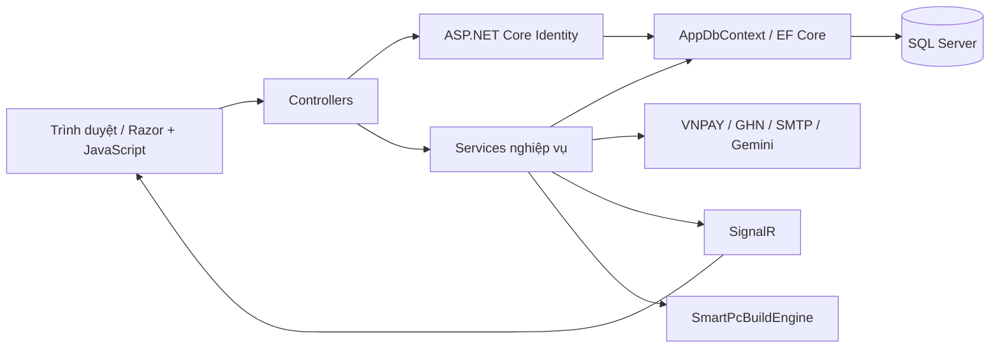
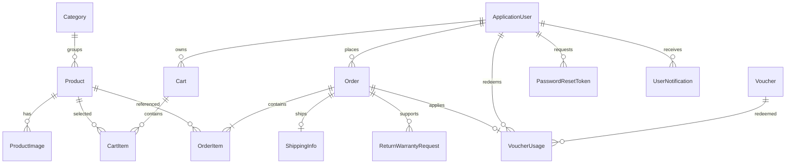

# Kiến trúc Techvora

ASP.NET Core MVC monolith: controller xử lý HTTP/phân quyền, service xử lý nghiệp vụ, EF Core truy cập SQL Server. Cách tổ chức này giữ việc chạy local đơn giản và kiểm tra transaction trên đúng database provider.

## ERD rút gọn

`Product.Socket`, `MemoryType`, `PowerWatts` nullable: null là chưa biết/không áp dụng. Giá khi đặt hàng được chụp vào `OrderItem.UnitPrice`, không tính lại theo giá sau này.

## Transaction và cạnh tranh

`DatabaseTransaction.ExecuteAsync` chạy toàn bộ unit of work qua execution strategy: tải lại entity, mở transaction, ghi và commit. Trạng thái tracking cũ được bỏ trước mỗi lần thử. Caller không được để thay đổi chưa lưu đi vào helper này.

- Checkout tính giá/voucher ở server; trừ kho bằng `UPDATE ... WHERE Stock >= quantity`. Giỏ, lượt voucher và đơn cùng transaction.
- Hủy đơn/callback khóa order bằng `UPDLOCK`; đọc lại trạng thái trước khi thay đổi.
- Callback kiểm tra chữ ký, số tiền, phương thức. Đơn đã trả tiền không phát lại email trạng thái.
- Reset mật khẩu khóa user, kiểm tra lại token, dùng Identity để đổi mật khẩu và vô hiệu hóa các token còn lại trong cùng transaction.
- Email và SignalR ở ngoài phần retry.

Integration test tạo database mới, chạy migration và dùng nhiều scope/connection để kiểm tra cạnh tranh. Đối soát commit không rõ kết quả và transactional outbox là các bước phát triển tiếp.

## Smart PC Builder

`SmartPcBuildService` tải inventory một lần rồi gọi thuật toán thuần C# `SmartPcBuildEngine`. Engine lọc ứng viên theo loại linh kiện, ngân sách/mục tiêu, chọn cấu hình theo trọng số và trả tổng giá/cảnh báo/giải thích.

Các file `Search`, `Compatibility`, `Profiles` chia tìm kiếm, quy tắc/điểm số và cấu hình mục tiêu. Socket/RAM chỉ lấy từ metadata. Thiếu dữ liệu thì cảnh báo; điểm workload, dự trù nguồn khi thiếu dữ liệu và airflow vẫn là heuristic.

## Asset và demo

CSS/JS theo chức năng trong `ClientAssets`, thứ tự trong manifest. Script Node sinh bản đầy đủ/minify; giữ các hàm global đang được Razor gọi. CI kiểm tra source và output.

Demo bật tường minh, bị chặn ở Production. Đơn mẫu là lịch sử minh họa; tồn kho seed đại diện hàng còn lại hiện tại. Seed không gọi nhà cung cấp ngoài. Database production migrate riêng, admin bootstrap bằng secrets.
